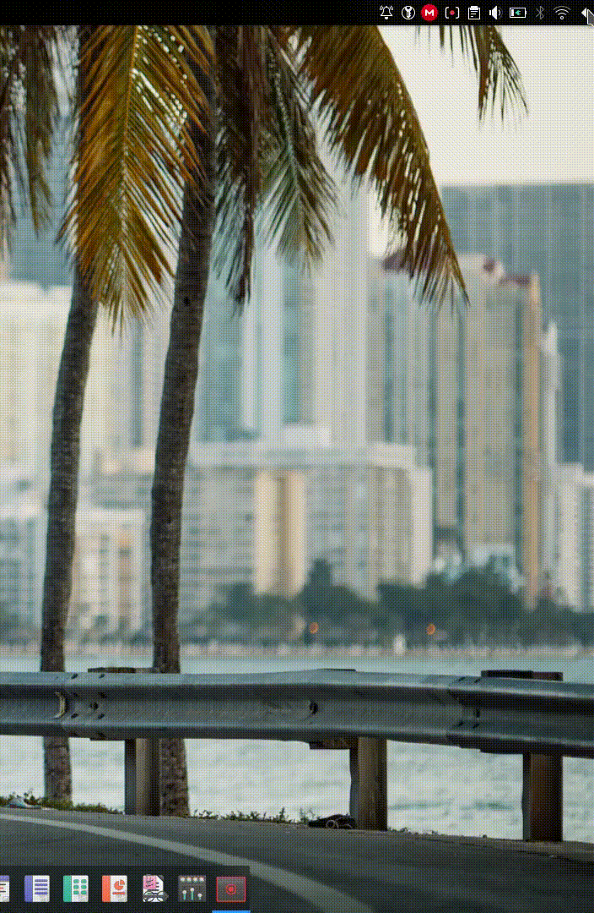

<h1 align="center">SysTrayModder</h1> 

Script to make the Plasma system tray behave like a sidebar.
 

**What does this script do?**

Copies your preexisting system tray widget that comes bundled with Plasma, and edits it so that the height of the tray takes up the entire available vertical space, and makes it so that the tray pops out from either side of the screen.

**Why copy the bundled tray, and not fork the system tray widget?**

Forking the system means having to keep up development with upstream to guarantee comparability and system security, which in and of itself isn't a bad thing, but that takes a lot of man-hours, and I don't want the responsibility. With this script, it is up to the user to run the script every time there is an update to the system tray widget.

**How do I make it do its magic?**

Run SysTrayModder.sh and follow instructions.

1. `git clone https://github.com/baduhai/SysTrayModder.git`
2. `cd SysTrayModder`
3. `chmod +x SysTrayModder.sh` 
4. `./SysTrayModder.sh`

**Currently tested on:**

- Plasma 5.18.4
- Plasma 5.18.5

**What does it look like in the end?**

